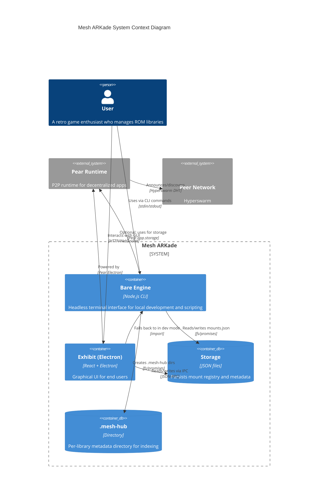

# Mesh ARKade Architecture

## C4 Context Diagram

## Component Overview

### Bare Engine (index.js)

The headless CLI component that runs in terminal mode. Provides:

- Interactive REPL for mount/unmount/list commands
- JSON mode for scripting integration
- First-run wizard for library setup

### Exhibit (Electron)

The graphical UI component powered by Pear Electron:

- React-based user interface
- Bridge communication with Core Hub
- Fallback to Bare Engine in development mode

### Storage Layer

- **mounts.json**: Global registry of mounted libraries
- **.mesh-hub/**: Per-library metadata directory containing indexing data

### Core Hub (hub.ts)

JSON-RPC server that handles:

- `curator:mount` - Register a new library
- `curator:unmount` - Remove a library
- `curator:list` - List all mounts

## Data Flow

1. User issues `mount /path/to/roms` command
2. Bare Engine calls Core Hub JSON-RPC
3. Curator validates path, creates .mesh-hub, counts ROMs
4. Atomic write to mounts.json via mutex-protected transaction
5. Mount info returned to user
