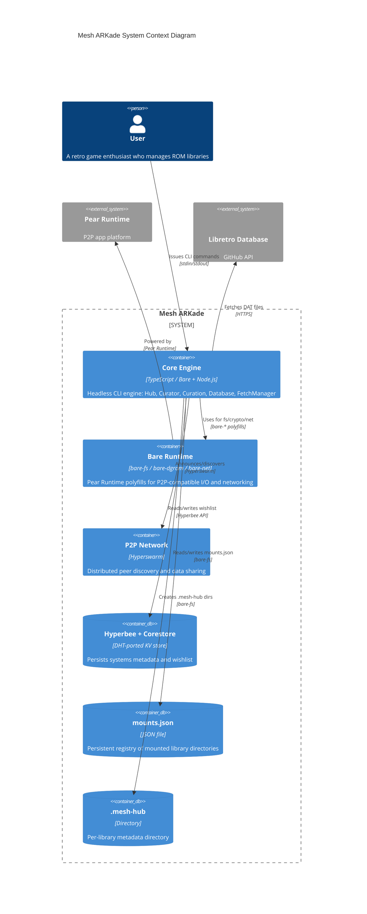

# Mesh ARKade Architecture

## Overview

MeshARKade is a decentralized, museum-quality, takedown-resistant game preservation platform built on the Pear Runtime. It operates headless-first, with the CLI as the primary interface and a GUI wrapper planned for future phases. All core logic runs in both the Bare and Node.js runtimes via a runtime abstraction layer.

The platform is **Curator-First**: nothing enters the collection until it is verified against a DAT file. The trust chain runs from authoritative DAT files (ground truth) through P2P retrieval to final SHA1 verification before a ROM is accepted.

## C4 Context Diagram



### External Dependencies

The Libretro DAT fetch (`core → libretro`) uses HTTPS because there is no P2P-native source for authoritative DAT files (No-Intro, Redump). This is a deliberate, bounded exception: read-only, infrequent, and limited to the curation bootstrap path. All ROM retrieval — the hot path — remains fully P2P via Hyperswarm, IPFS, and BitTorrent DHT.

## Runtime Abstraction

All core logic must run in both the **Bare runtime** (Pear) and Node.js. The `src/core/runtime.ts` module provides a unified API that resolves to the correct implementation at runtime:

| Function      | Bare fallback | Node.js fallback                  |
| ------------- | ------------- | --------------------------------- |
| `getFs()`     | `bare-fs`     | `fs`                              |
| `getPath()`   | `bare-path`   | `path`                            |
| `getOs()`     | `bare-os`     | `os`                              |
| `getFetch()`  | `bare-fetch`  | `globalThis.fetch` / `node-fetch` |
| `getCrypto()` | `bare-crypto` | `crypto`                          |

The `hashFileStreaming()` function computes file hashes without loading the entire file into memory, using `createReadStream` when available.

**No file:** `src/core/paths.ts` is a leaf module — it has no `src/` imports and must remain that way to avoid circular dependencies. It returns `Pear.app.storage` when running in Pear, or `./data` otherwise.

## Core Hub (`src/core/hub.ts`)

The **Core Hub** is the singleton engine that manages all core functionality. It exposes a JSON-RPC interface over a local Unix socket, allowing any interface (CLI or future GUI) to act as a client.

**Singleton pattern:** `CoreHub` uses a private constructor and `static getInstance()` to guarantee exactly one instance. `resetInstance()` is available for testing.

**IPC commands:**

| Method                 | Description                                    |
| ---------------------- | ---------------------------------------------- |
| `status`               | Returns hub running state and paths            |
| `ping`                 | Health check — returns `{ pong: true }`        |
| `curator:mount`        | Register a library directory                   |
| `curator:unmount`      | Deregister a library directory                 |
| `curator:list`         | List all mounted libraries                     |
| `curation:seed`        | Fetch and parse a system DAT into the wishlist |
| `curation:search`      | Search the wishlist                            |
| `curation:systems`     | List available game systems                    |
| `curation:lookup-sha1` | Look up a ROM by SHA1 hash                     |
| `database:reset`       | Wipe and reinitialize the database             |

On `stop()`, the Hub calls `closeDatabase()` to tear down the Hyperbee and Corestore connections.

## Curator (`src/core/curator.ts`)

The Curator manages the **cellular library model**: each mounted directory is a self-contained ROM library with a `.mesh-hub` marker directory. The Curator does not copy or move files — it registers and tracks paths.

**Factory pattern:** `createCurator()` returns a new `CuratorClass` instance. This allows the Curator to be instantiated fresh per operation without holding global state.

**Key operations:**

- `mount(path)`: Validates the directory, creates `.mesh-hub`, scans for ROM files (by extension), and persists to `mounts.json`.
- `unmount(path)`: Removes the path from `mounts.json`.
- `listMounts()` / `getMount(path)`: Query the mount registry.

ROM extensions recognized include: `.zip`, `.7z`, `.nes`, `.snes`, `.smc`, `.sfc`, `.gba`, `.gbc`, `.gb`, `.n64`, `.z64`, `.v64`, `.iso`, `.bin`, `.cue`, `.gen`, `.sms`, `.pce`, `.pc10`, `.ws`, `.wsc`, `.nds`, `.3ds`, `.cia`, `.xci`, `.nsp`, `.vpk`, `.pbp`, `.chd`, `.rvz`, `.wad`, `.wbfs`, `.gcm`, `.gcz`, `.narc`, `.cci`.

## Storage Layer (`src/core/storage.ts`)

The storage layer manages the `mounts.json` registry and the `.mesh-hub` marker directories.

**Mutex-protected transactions:** `withMutex()` serializes all reads and writes to `mounts.json` to prevent lost updates from concurrent access. Write operations are atomic: content is written to a `.tmp` file and renamed on success.

**`MESH_HUB_DIR = ".mesh-hub"`:** This hidden directory is created inside each mounted library. It serves as the canonical marker for a sanctified library path.

## Database (`src/core/database.ts`)

The database uses **Hyperbee + Corestore** for metadata storage. This choice was made in ADR #2 because Hyperbee is DHT-ported and P2P-portable, unlike SQLite.

**Singleton pattern:** Module-level singletons (`store`, `bee`, `systemsBee`, `wishlistBee`) are initialized lazily on first `getDatabase()` call.

**Namespaces:**

- Root bee (`db`): The top-level Hyperbee instance.
- Sub-bee `systems`: Stores `SystemRecord` entries (system ID → metadata).
- Sub-bee `wishlist`: Stores `WishlistRecord` entries (keyed by `system_id!sha1` or `system_id!title-slug`).

**Teardown sequence (PR #18):** `closeDatabase()` closes resources in **reverse order** of initialization to avoid use-after-close:

```
Initialize: store → core → bee → systemsBee / wishlistBee
Tear down:  systemsBee → wishlistBee → bee → store
```

This order matters because sub-bees depend on the parent bee, and the bee depends on the Corestore core.

**`resetDatabase()`** closes all connections, deletes the on-disk storage directory, and resets module state so the next `getDatabase()` call creates a fresh empty store.

## Curation Manager (`src/core/curation.ts`)

The Curation Manager handles DAT file fetching, parsing, and wishlist management.

**Factory pattern:** `createCurationManager()` returns a new `CurationManagerClass` instance.

**System catalog:** `fetchSystems()` retrieves the list of available game systems from the Libretro database GitHub API. Results are cached for 24 hours. System IDs are normalized via a comprehensive alias table (e.g., "Nintendo Entertainment System" → "nes").

**Seeding a system:**

1. Fetch the system definition (or throw if unknown).
2. Fetch the DAT file from the Libretro mirror.
3. Parse the DAT (via `dat-parser.ts`).
4. Upsert the system record.
5. Batch-insert wishlist records in chunks of 100.

**Wishlist search:** `searchWishlist()` performs a case-insensitive substring scan of the wishlist, optionally filtered by system ID, limited to a configurable number of results.

**SHA1 lookup:** `getWishlistBySha1()` scans the wishlist for a record matching a full 40-character SHA1 hash.

## Fetch Manager (`src/fetch/fetch-manager.ts`)

The Fetch Manager orchestrates **sequential layer fallback** for ROM retrieval. It tries each layer in order until one succeeds, or collects all errors and throws `AllLayersFailedError`.

**Layer order:** Hyperswarm → IPFS → BitTorrent DHT

Each layer receives the same inputs (SHA1 hash) and returns `Uint8Array`. Progress callbacks report bytes received per layer.

`fetchAndStage(sha1, destDir, records)` writes the fetched data to disk, resolving the filename from the wishlist record if provided.

## Fetch Layers (`src/fetch/layers/`)

### Hyperswarm Layer (`hyperswarm.ts`)

Uses Hyperswarm's pub-sub topic system. The SHA1 hash is zero-padded to a 32-byte topic buffer and joined as a **client-only** discovery (receive-only per design spec). When a peer connects, all data is streamed until the connection ends.

### IPFS Layer (`ipfs.ts`)

Uses the **Museum Map** (`museum-map.ts`) to resolve SHA1 → CID, then fetches from an IPFS gateway. If the SHA1 is not in the map, the layer throws immediately without a network request.

### BitTorrent Layer (`bittorrent/`)

A custom, Bare-compatible BitTorrent implementation split into focused modules:

| Module               | Responsibility                                                                                                                                                   |
| -------------------- | ---------------------------------------------------------------------------------------------------------------------------------------------------------------- |
| `bencode.ts`         | Bencode encode/decode using `Uint8Array` byte arithmetic — no `TextDecoder` (avoids Windows-1252 corruption of bytes 0x80–0x9F).                                 |
| `dht-utils.ts`       | Kademlia primitives: `xorDistance`, hex↔buf conversion, random node ID, `DHTNode`/`DHTMessage` types, peer/node parsing, `get_peers` query construction.         |
| `udp-transceiver.ts` | UDP socket wrapper using `bare-dgram`. Tracks pending transactions by ID, routes responses via callbacks, handles timeouts.                                      |
| `dht-client.ts`      | Kademlia crawler. Recursive `get_peers` lookups starting from bootstrap nodes, converging on the closest nodes to the target SHA1.                               |
| `tcp-peer.ts`        | BitTorrent Wire Protocol via `bare-net`. TCP handshake, PIECE aggregation, dual-timer pattern (`deadlineTimer` + `inactivityTimer`), SHA1 verification per peer. |
| `index.ts`           | Public boundary. `fetchFromBittorrent(sha1, options)` orchestrates DHT lookup → peer iteration → SHA1 verification.                                              |

**Deviations from standard BEP 3:**

1. **SHA1-as-`info_hash`**: Uses the ROM's SHA1 directly as the DHT `info_hash` — no `.torrent` file. Peers find ROMs by content hash.
2. **Raw `Uint8Array` bdecode**: Byte-level index arithmetic instead of `TextDecoder` to avoid byte corruption.
3. **Dual-timer pattern**: `deadlineTimer` enforces the overall fetch deadline; `inactivityTimer` (reset per block) prevents adversarial peers from holding connections open indefinitely with data trickles.

## Trust Chain

The curator-first trust chain guarantees museum-quality content regardless of which peer serves a file:

1. **DAT File (Ground Truth)**: Authoritative DAT files (No-Intro, Redump) loaded via `curation.seed`. The DAT provides the canonical SHA1 for each title/region.
2. **P2P Retrieval**: The ROM is fetched through Hyperswarm, IPFS, or BitTorrent DHT — any peer in the mesh can serve the file.
3. **Final Hash Verification**: Before yielding the file up the stack, the fetched data is hashed with `getCrypto().createHash('sha1')` and compared against the DAT-provided hash. Any mismatch drops the file and retries the next peer.

## Data Flow

**Mounting a library:**

1. User issues `mount /path/to/roms` CLI command.
2. CLI calls `curator:mount` on the Hub via JSON-RPC.
3. Curator validates the path, creates `.mesh-hub`, scans for ROM files.
4. Atomic write to `mounts.json` via mutex-protected transaction.
5. Mount record returned to user.

**Seeding a system:**

1. User issues `init --seed=nes` CLI command.
2. CLI calls `curation:seed` on the Hub.
3. Curation Manager fetches the NES DAT from Libretro.
4. DAT is parsed into game records with SHA1, CRC, MD5.
5. Records are batch-inserted into the `wishlist` Hyperbee sub-bee.
6. Result returned to user.

**Fetching a ROM:**

1. User issues a fetch command (CLI or future GUI).
2. `FetchManager.fetch(sha1)` tries Hyperswarm first.
3. On failure, tries IPFS (Museum Map → gateway).
4. On failure, tries BitTorrent DHT (Kademlia lookup → TCP peer → piece assembly).
5. Each layer's result is verified against the DAT-provided SHA1.
6. Verified `Uint8Array` returned.

**Teardown (Hub stop / app exit):**

1. Hub `stop()` calls `closeDatabase()`.
2. Sub-bees closed first: `systemsBee` → `wishlistBee`.
3. Root bee closed: `bee`.
4. Corestore closed: `store`.
5. All module-level singletons nulled.

## Module Map

| File                                             | Role                                                                    |
| ------------------------------------------------ | ----------------------------------------------------------------------- |
| `src/core/runtime.ts`                            | Dual-runtime abstraction (Bare/Node) for fs, path, crypto, fetch        |
| `src/core/paths.ts`                              | Storage base path resolution (leaf — no src/ imports)                   |
| `src/core/storage.ts`                            | `mounts.json` registry with mutex and atomic writes; `.mesh-hub` marker |
| `src/core/database.ts`                           | Hyperbee + Corestore singleton; `systems` and `wishlist` sub-bees       |
| `src/core/hub.ts`                                | Singleton JSON-RPC hub over local socket; command router                |
| `src/core/curator.ts`                            | Library mount manager; `.mesh-hub` creation; ROM scanning               |
| `src/core/curation.ts`                           | DAT fetching/parsing; wishlist management; system catalog               |
| `src/core/dat-parser.ts`                         | CLRMamePro DAT file parser                                              |
| `src/fetch/fetch-manager.ts`                     | Sequential P2P layer fallback orchestrator                              |
| `src/fetch/layers/hyperswarm.ts`                 | Hyperswarm pub-sub fetch layer                                          |
| `src/fetch/layers/ipfs.ts`                       | IPFS gateway fetch layer with Museum Map                                |
| `src/fetch/layers/bittorrent/index.ts`           | BitTorrent public boundary + SHA1 verification                          |
| `src/fetch/layers/bittorrent/bencode.ts`         | Bencode codec (Uint8Array arithmetic)                                   |
| `src/fetch/layers/bittorrent/dht-utils.ts`       | Kademlia primitives and types                                           |
| `src/fetch/layers/bittorrent/udp-transceiver.ts` | UDP socket wrapper (bare-dgram)                                         |
| `src/fetch/layers/bittorrent/dht-client.ts`      | Kademlia crawler                                                        |
| `src/fetch/layers/bittorrent/tcp-peer.ts`        | BitTorrent Wire Protocol (bare-net) + dual-timer                        |
| `src/fetch/trust.ts`                             | Trusted DAT source registry and verified fetch                          |
| `src/fetch/errors.ts`                            | `FetchLayerTimeoutError`, `FetchLayerError`, `AllLayersFailedError`     |
