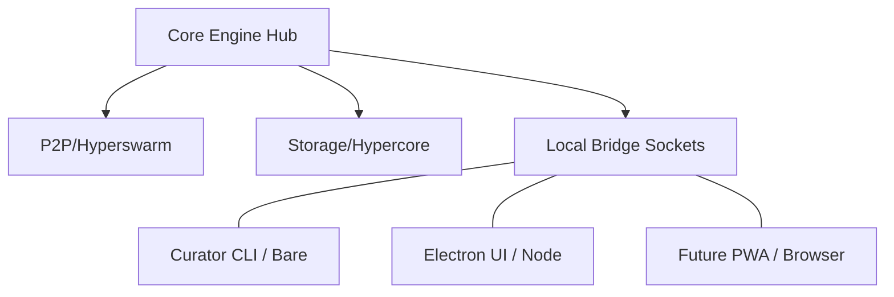

# Design: Core Engine Foundation

## Architecture: The "Hub" Model
The engine operates as a singleton "Hub" that manages the P2P swarm and storage. Any interface (CLI or GUI) acts as a client to this Hub.

## Component Hierarchy

### 1. `src/core/branding.ts`
- **Shared Module**: Export-only logic for tagline generation and identity.
- **Bare Compatible**: No `process`, `window`, or `document` references.
- **TDD Requirement**: Must include a `__tests__/branding.test.ts` file.

### 2. `index.js` (Entry Point)
- **Environment Detection**: 
  - `Pear.app.key === null` -> Local development.
  - Check `Pear.app.args` for `--bare` or `--headless` flags.
- **Boot Routine**:
  - Headless: Initialize `TerminalHub`.
  - GUI: Initialize `ElectronBridge`.

### 3. IPC Bridge
- **Socket Path**: Use a named pipe or unix socket relative to `Pear.app.storage`.
- **Protocol**: Simple JSON-RPC over the socket for status and scanning commands.

## Constraints & Requirements
- **Runtime**: Must be compatible with **Bare v1.0+**.
- **Logging**: Use a unified logger that redirects to `stdout` in terminal mode and the Electron console in GUI mode.
- **Comments**: Adhere strictly to the TSDoc guarantee-based style guide.
