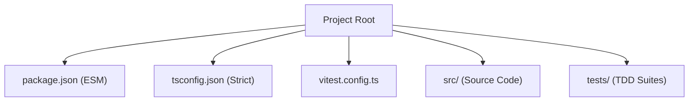

# Environment Design: TypeScript + Vitest + TSDoc

## Context

The `mesh-arkade` project is in its early stages. We have established architectural guidelines but lack the tooling to enforce type safety, documentation standards, and Test-Driven Development (TDD). 

## Solution

We will implement a modern TypeScript toolchain tailored for the Pear Runtime (Bare JS) environment:
1.  **Package Manager**: NPM (standard).
2.  **Runtime Support**: ESM (native to Bare).
3.  **Type System**: Strict TypeScript configuration to prevent runtime errors in P2P logic.
4.  **Testing**: **Vitest** for its lightweight ESM support and compatibility with Vite.
5.  **Documentation**: TSDoc comments required for all public-facing APIs.

## Architecture

## Risks / Trade-offs

- **Bare vs. Node**: Bare JS has different built-ins. We must prioritize `bare-*` modules and ensure tests run in a compatible environment.
- **TDD Overhead**: Initial development may feel slower, but it is critical for museum-quality P2P software.
