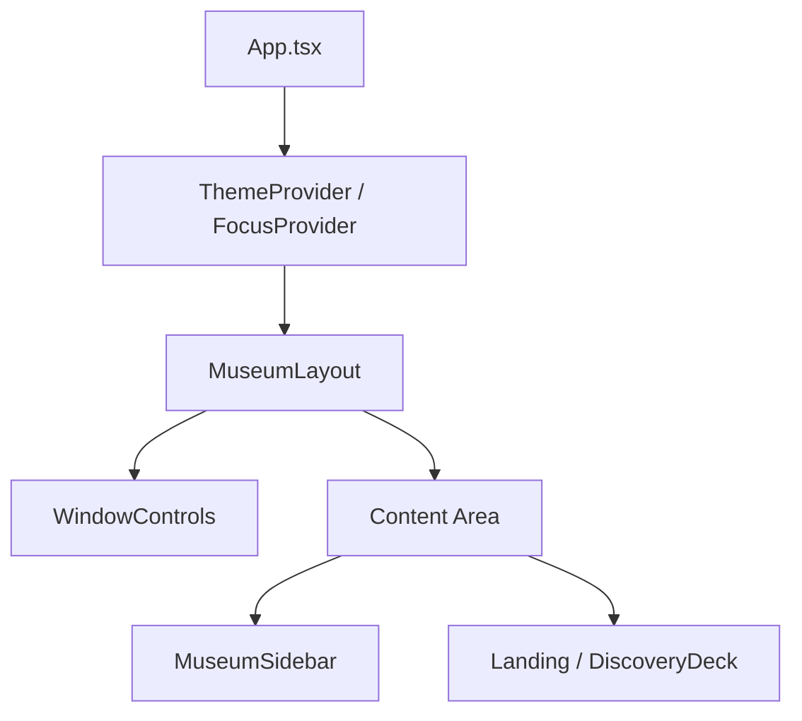

# Design: Museum Layout and Focus States

## Component Hierarchy
The application will follow a nested layout structure to ensure persistent UI elements (Sidebar, Window Controls) are decoupled from the main content views.

## MuseumLayout Component
The `MuseumLayout` will be a functional component that uses CSS Grid or Flexbox to provide a stable shell.
- **Top Row**: Fixed height (approx 32px) for `WindowControls`.
- **Center**: Sidebar (left) + Hero/Content (right).
- **Z-Index**: `WindowControls` must remain at the top of the stack for dragging/interactions.

## Focus State Management
To support upcoming Gamepad navigation:
1. **Focus Rings**: Standard browser focus rings will be disabled (`outline: none`) and replaced with a custom CSS class `.retro-focus`.
2. **Style**: `.retro-focus` will apply a 4px offset border in `--retro-accent` (Neon Yellow) or `--retro-primary` (Neon Magenta).
3. **FocusScope**: We will use `react-aria` or a similar pattern to trap focus within the Sidebar or the Discovery Deck when active.

## Technical Tasks (High Level)
1. **Sidebar implementation**: Uses `8bitcn/button` and `lucide-react` icons.
2. **Layout wrapper**: Wraps `Routes` or the main view component.
3. **Global CSS Update**: Define the `.retro-focus` utility in `index.css`.
